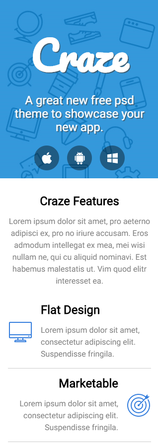

# arctouch_admission_test
Demo product's landing-page layout implementation with React.js.
This is part of the hiring process at ArcTouch company.


## Guidelines

As provided in the e-mail, application should follow some specifications:

* Develop a static page following provided layout.
* Use any tools necessary for the job, except for the carousel component (which should be created from scratch).
* Develop a mobile experience too.
* Carousel should have animation for slide changes and the user should be able to change the slide.
* Carousel should auto-change slide every 4 seconds (when interacted it should stop this behavior).
* Also deliver instruction for building the project.


### Installing

This code was developed using [Yarn](https://yarnpkg.com/pt-BR/) as its package manager. It can be installed with:
```
npm install -g yarn
```

After this, run:
```
yarn install
```
to download all project dependencies.

This project uses [Webpack](https://webpack.js.org/) to startup a local server, compile files and etc.

Webpack will create the bundle.js file and Webpack-dev-server will create the development server to host the index file.
Cross-env will make sure our CLI commands will run properly on all OS.

Now with Yarn installed, run:
```
yarn start
```
to have application running on localhost:8080

To build the project, run:
```
yarn build
```
This will create the .html and .js files inside the *dist* folder, ready for production.

Linting is also available using:
```
yarn lint
```
to check code correctness.


### Troubleshooting

In case I forgot to list a package that was not found, please 'yarn add' it or 'npm install -g' it so the scripts can run properly.


### Project Details

The idea for this project was to create a simple React.js stack, without relying on redux or flux for store handling. It is written using ES6 and transpiled with [Babel](https://babeljs.io/). Code styling was ensured using [ESLint](https://eslint.org/).

For the layout, I used [Tachyons](http://tachyons.io/), as it provides an 'almost-minified' stylesheet defining a whole styleguide ready to use. This includes media queries, font sizes, display types, colors, etc...

It is very noticeable that many of the colors in this app does not follow what the PSD showed, that's why tachyons has it's own color palette that I used without customizing it. Even so I tried to follow the gradients to match what was provided.

Some spacings suffered from the same issue, as Tachyons defines it's own scale for paddings and margins. I tried using classes that followed the design the closest.

Had to do some tricks with borders and pseudo-elements for rendering the 'features list' and intended (with border that doesn't go all the way around the elements...)

Carousel does the automatic transition when page loads. If the user interact with the controls, the 'auto' feature stops. I achieved the result using opacity transitions on 'stacked' elements (everyone absolute positioned in the same place). I wanted to try this approach, as I've recently implemented another carousel like transition in this project: [chaordic_admission_test](https://github.com/raphalupi/chaordic_admission_test). Please have a look at that code for examples of how I implemented the scroll effect (margins manipulation).

Regarding the things **I didn't manage to achieve**:
* Find the exact font-faces online. I ended up using Roboto for everything (as a sans-serif), and Pacifico for the logo (way thicker than the provided one).
* Use the exact same icons as provided. I ended up getting similar ones and added their svgs to icon components.
* Getting the video player to run with as little information on screen as possible (like showed in the PSD).
* Getting the video player's borders to be round (search for it online, but found no way to modify it over the tachyons classes).

Other information can be found throughout the code.

Some examples:




## Author

* **Raphael Lupchinski** - [LinkedIn](https://www.linkedin.com/in/rlupchinski/)
